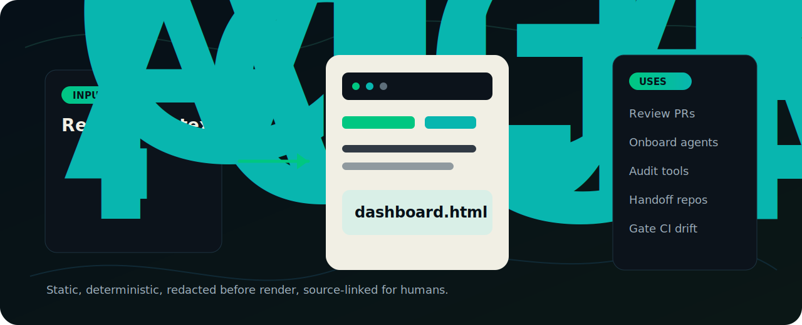

# Agent Context Center

AI agents have `AGENTS.md`. Humans need `dashboard.html`.

Agent Context Center turns a repo's scattered AI operating layer into one committed,
offline HTML dashboard. Claude Code instructions, Codex prompts, Cursor rules, MCP
servers, hooks, commands, skills, docs, and open TODOs become a source-linked map that a
human can review in a browser.

[View the demo dashboard](https://omerakben.github.io/agent-context-center/demo/dashboard.html)
· [Open the public site](https://omerakben.github.io/agent-context-center/)
· [Install from GitHub](#quickstart)


## Why use it

Modern repos increasingly have two codebases:

- the product code people review every day
- the AI context that tells agents how to work in that repo

The second one is easy to miss. It lives in `CLAUDE.md`, `AGENTS.md`,
`.claude/agents`, `.codex/prompts`, Cursor rules, MCP config, docs, and TODOs. Agent
Context Center makes that layer visible, diffable, and safe to hand off.

Use it when you need to:

| Use case | What ACC gives you |
| --- | --- |
| Onboard a developer or coding agent | One browser page showing the repo's AI instructions, tools, prompts, docs, and TODOs. |
| Review a pull request that changes agent behavior | A regenerated `dashboard.html` diff beside the markdown/config diff. |
| Audit MCP, hooks, and commands | A provider-aware inventory with source paths and redacted config summaries. |
| Handoff a repo between humans or agents | A deterministic snapshot of what the repo declares, not a chat-only explanation. |
| Keep AI context fresh in CI | `acc doctor --strict` flags stale dashboards and weak metadata without network or model calls. |
| Explain the repo's AI surface publicly | A static demo artifact you can open from `file://`, GitHub Pages, or a PR. |



## The pitch

Markdown stays the source of truth. The dashboard is the human map.

ACC is not an agent runtime and it does not control tools. It reads the files already in
your repo, normalizes them through provider adapters, redacts secret-shaped values, and
emits a self-contained `dashboard.html`. You can commit it, diff it, open it offline, and
ask reviewers to inspect it like any other generated artifact.

## Quickstart

`acc` is stdlib Python 3.12+ with no third-party runtime dependencies. There are two ways
to run it.

### Inside Claude Code (no install)

```text
/plugin marketplace add omerakben/agent-context-center
/plugin install agent-context-center@ozzy-skills
/dashboard
```

`/dashboard` runs the bundled generator against the repo you launched Claude Code in. No
pip install, no network. It needs `python3` 3.12+ on your PATH; if yours is older, the
command tells you instead of failing with a stack trace.

### Standalone CLI

`acc` is a command-line app, so install it isolated. A bare `pip install` is refused by
Homebrew and Debian Python (PEP 668, "externally-managed-environment"), so use `pipx` or
`uv`, which put `acc` on your PATH in its own environment:

```bash
pipx install "git+https://github.com/omerakben/agent-context-center"
# or:  uv tool install "git+https://github.com/omerakben/agent-context-center"
acc --root .
```

<details>
<summary>No pipx or uv? Use a stdlib virtual environment.</summary>

```bash
python3 -m venv .venv && . .venv/bin/activate
pip install "git+https://github.com/omerakben/agent-context-center"
acc --root .
```

</details>

`acc --root .` writes `dashboard.html` into the auto-detected provider folder, for example
`.claude/dashboard.html`, or `.agent-context-center/` if no provider is found. It prints
the path, source digest, scanned file count, and providers. Open the printed path in a
browser. No server. No network.

Write the dashboard at the repo root instead:

```bash
acc --root . --out .
```

`--out` takes a directory, not a filename.

The dashboard header shows the repo name. It comes from `pyproject.toml`
`[project].name`, then `package.json` `name`, then the directory name. Pin it explicitly
when you need byte-stable output across differently named clones:

```bash
acc --root . --repo-name my-repo
```

## What it maps

| Source | Status |
| --- | --- |
| Claude Code: `CLAUDE.md`, `.claude/agents`, `.claude/commands`, `.claude/skills` (`SKILL.md`), hooks and MCP from `.claude/settings.json` and `.mcp.json` | Supported today |
| Codex: `AGENTS.md`, `.codex/prompts`, `.codex/config.toml` MCP and config facts | Supported today |
| Cursor: `.cursorrules`, `.cursor/rules/*.mdc`, `.cursor/mcp.json` | Supported today |
| Generic markdown indexing for any other `.md` as docs | Supported today |
| Open TODOs from `- [ ]` checkbox lines | Supported today |
| Cross-references from docs to inventory paths and config files to declared MCP/hooks | Supported today |
| Redaction before rendering with a final output tripwire | Supported today |
| `GEMINI.md` and `.github/copilot-instructions.md` as first-class adapters | Planned |
| PRD, ADR, decision, and workflow classification | Planned |
| Published reusable GitHub Action | Planned, today a copyable workflow template is included |
| Health score | Planned, today `acc doctor` reports concrete findings |

## Demo scripts

Use these as developer-advocate walkthroughs.

### One-minute repo orientation

```bash
acc --root . --out .
open dashboard.html
```

Show the overview cards, provider chips, search box, and source-linked inventory. The
message is simple: a maintainer can understand the repo's AI layer without opening every
hidden folder. In normal repo use, you can omit `--out .` and open the path printed by
the command.

### PR review of AI behavior

```bash
acc --root .
git diff -- '**/dashboard.html'
```

Change an agent, prompt, hook, or MCP config, regenerate, then review the dashboard diff.
The generated artifact makes behavior changes visible to reviewers who do not know every
provider's file layout.

### CI freshness gate

```bash
acc doctor --root . --strict
```

Use the included workflow template in `templates/refresh/ci-drift-check.yml` to fail a PR
when the committed dashboard is stale.

## Guarantees

- Static HTML, offline, no runtime network.
- No server, database, CDN, telemetry, or build step.
- Deterministic and byte-stable for unchanged inputs.
- Redaction runs before rendering.
- Structured config uses allowlisted fields.
- The renderer is `textContent` only, so repo content cannot inject script.
- Works air-gapped once installed locally.
- Stdlib Python 3.12+ only.

## What this is not

- Not an agent runtime or orchestrator.
- Not control of agents.
- Not a cloud service or SaaS.
- Not a replacement for markdown, Claude Code, Codex, Cursor, Copilot, or MCP.
- Not a full secret scanner.
- Not a policy engine or mission-control system.

It maps, inspects, summarizes, and source-links. It does not manage or run anything.

## acc doctor

`acc doctor` reads the repo and prints deterministic findings. It uses no git history,
mtimes, network, or model judgment, so the same repo yields the same report.

It checks for a stale dashboard, missing or unreadable dashboard, generator-version
drift, weak metadata, near-empty instruction files, large files, conservative broken
relative markdown links, redacted secret-shaped values, and open TODOs.

```bash
acc doctor --root .            # print findings
acc doctor --root . --strict   # exit 1 if any warning
acc doctor --root . --json     # a doctor.v1 report
```

Exit codes:

- `0` clean, or warnings without `--strict`
- `1` warnings with `--strict`
- `2` execution error

Example report shape:

```text
Agent Context Center - doctor
Root: /repo
Files scanned: 24 · providers: claude, codex
Dashboard: .claude/dashboard.html
Status: needs attention
Findings:
  ! [stale-dashboard] .claude/dashboard.html is stale (built from a1b2c3, current is d4e5f6) - re-run `acc --root .`.
  ! [weak-metadata] 2 agent/skill/command/rule file(s) have no description (e.g. .claude/agents/triage.md) - add a `description:` so humans and agents know the intent.
  · [open-todos] 5 open `- [ ]` TODO(s) found.
Next: run `acc --root .` to (re)generate the dashboard.
```

## For teams and CI

Commit `dashboard.html` next to the markdown it describes. A pull request then shows the
dashboard diff alongside the context changes, so a reviewer sees what moved without
opening each file.

A static `file://` page cannot tell it is stale, so refresh is explicit. Add a CI drift
check that regenerates the dashboard and fails if the committed copy fell behind:

```bash
acc --root .
git diff --exit-code -- '**/dashboard.html'
```

Or run `acc doctor --root . --strict`, which exits `1` on a `stale-dashboard` finding. A
copyable workflow lives at
[`templates/refresh/ci-drift-check.yml`](templates/refresh/ci-drift-check.yml).

## Security and redaction

Before anything reaches the file, structured provider config is allowlisted and
free-form prose runs through a high-precision secret-shaped-string scanner. A tripwire
re-scans the assembled output.

This is not a full entropy scanner. A high-entropy value with no telltale prefix can
slip through. Review a generated dashboard before publishing one from a repo with
unusual secrets.

## Roadmap

See [ROADMAP.md](ROADMAP.md).

## Contributing

See [CONTRIBUTING.md](CONTRIBUTING.md).

## License

MIT. See [LICENSE](LICENSE).
