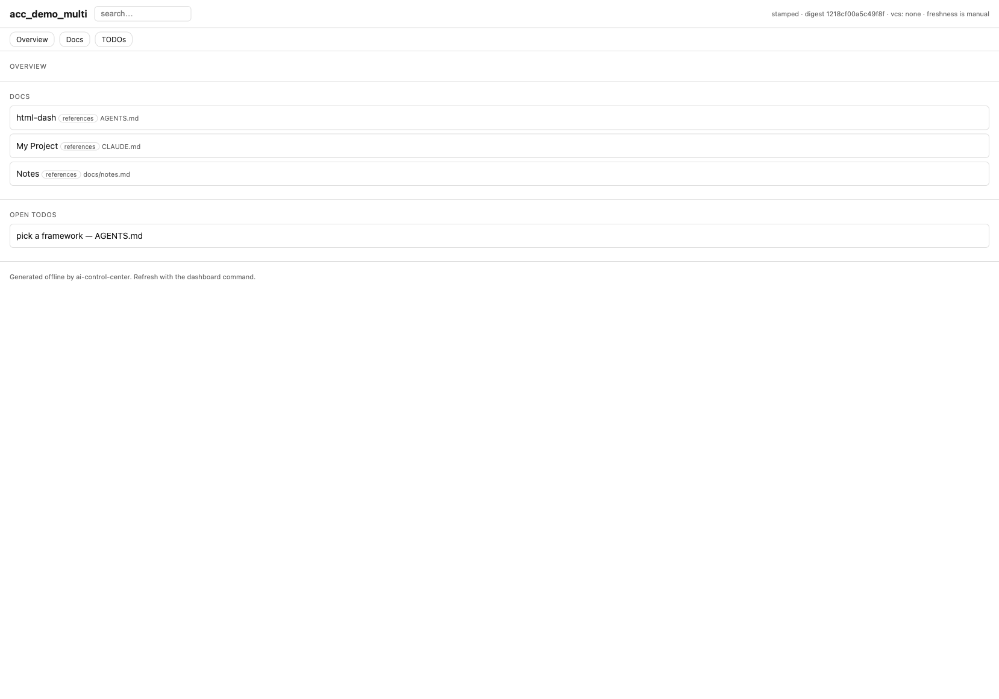

# AI Control Center

One self-contained HTML file that turns a repo's scattered AI markdown into a control
center a human can actually navigate.



## The problem

Markdown is the right format for AI agents. Config, intent, decisions, and capability
definitions live in `CLAUDE.md`, `AGENTS.md`, Cursor rules, skills, agents, hooks,
commands, MCP config, PRDs, and ADRs. Agents read and write it well. Humans lose the
thread once a repo holds dozens of these files spread across `.claude/`, `docs/`, and the
tree: what exists, how it connects, what was decided, where the project stands.

## What it does

It keeps markdown as the source of truth for the machine and adds one layer for the
person: a single HTML dashboard that mirrors the markdown and makes it navigable. You
open one file and see scope, the inventory of skills, agents, hooks, commands, MCP
servers, and rules, the doc index (PRDs, ADRs, decisions, workflows, references), open
TODOs, and how the pieces cross-reference each other. There is a global search box and a
cross-reference view.

A bundled stdlib-Python generator scans the repo, maps each provider through an adapter
into one schema, redacts secrets, and stamps a single `dashboard.html` with the data
inlined as a JSON island and a vanilla-JS renderer. No build step, no runtime
dependencies, no network.

## Install

In Claude Code:

```text
/plugin marketplace add omerakben/ai-control-center
/plugin install ai-control-center@ozzy-skills
```

Then, from inside any repo you are working in:

```text
/dashboard
```

The command writes `dashboard.html` under the repo's provider folder (`.claude/`,
`.codex/`, or `.cursor/`) and reports the path, the source digest, and how many files it
scanned. Open that file in a browser — it needs no server.

It runs the bundled generator with stdlib Python 3.12+; if your `python3` is older (stock
macOS ships 3.9), the command says so and points you at an install instead of failing
with a stack trace.

### Without the plugin

The generator is a plain Python package, so you can run it directly:

```bash
pip install "git+https://github.com/omerakben/ai-control-center"   # stdlib only, no deps
acc --root .                                                        # or: acc --root . --json
```

## What it guarantees

- Deterministic output. Every list is explicitly sorted, so re-stamping a repo with no
  content change produces byte-identical HTML and no diff.
- Offline. The generator makes no network calls and needs no build step or framework.
- Render safety. The renderer writes text with `textContent` and injects only a sanitized
  markdown subset, so repo content cannot inject script into the committed HTML. A CI
  guard greps the renderer for `innerHTML`-family sinks.
- Redaction at extraction. Structured provider config is allowlisted (only known-safe
  fields pass), and free-form prose runs through a high-precision secret-shaped-string
  scanner before anything reaches the file; a tripwire re-scans the assembled output. The
  prose tier favors precision over recall, so a high-entropy value with no telltale prefix
  can slip through — review a generated dashboard before publishing one from a repo with
  unusual secrets.

## Keeping it fresh

A static `file://` page cannot tell that it is stale, so refresh is explicit. Two tiers
are active out of the box: the `/dashboard` command, and the agent re-stamping after it
edits AI markdown. Three more are opt-in templates under
[`templates/refresh/`](templates/refresh/) — a git post-commit hook, a Claude Code
file-write hook, and a CI drift check that fails when the committed dashboard falls behind.

## How it is built

- `src/acc/generate.py` orchestrates: scan, per-provider normalize, merge, escape, build
  the search index and relationships, validate, render.
- `src/acc/adapters/` holds first-class adapters for Claude Code, Codex, and Cursor over a
  shared base, plus a generic fallback that inventories any repo's markdown.
- `src/acc/templates/` holds the HTML template, the renderer, and styles.
- `tests/` is a flat pytest suite, including a real-Chromium Playwright DOM test and the
  renderer-sink CI guard.

Read the [design spec](docs/superpowers/specs/2026-05-29-ai-control-center-design.md) for
the schema, adapter interface, generation pipeline, and security model.

## Scope

v1 covers a deterministic inventory, the doc index, a flat relationship list, project
facts, three-tier refresh, redaction, sanitized rendering, the three first-class adapters
plus the generic fallback, and a global search — at the project level. A cross-repo view,
an interactive relationship graph, and richer workflow interpretation are deferred to v2.

## License

MIT — see [LICENSE](LICENSE).
